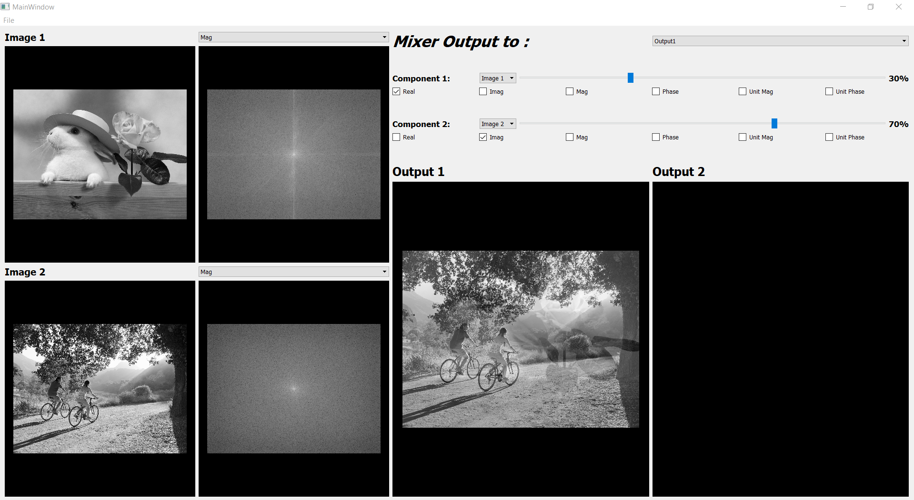
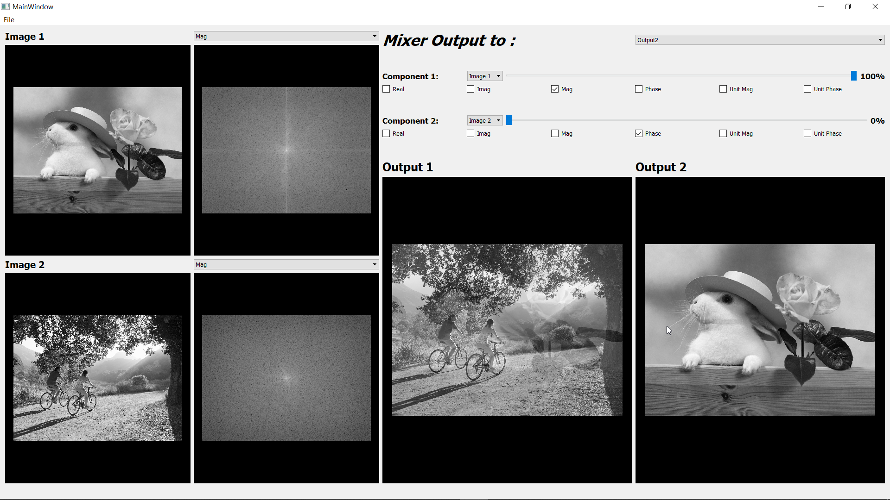

## Name: Ahmed Adel Ahmed

## steps
you can go to main.py and run it

almost all bugs are solved now ...

Note: you can't choose unit phase with unit mag here because that doesn't make any sense for the purpose of the program

# MagnitudePhaseMixerTemplate
Starter Template for Magnitude Phase Mixer Task

i make the test function (mix) but i can't run the test file

## Results

image1: (0.3 real , 0.3 imaginary) , image2: (0.7 real , 0.7 imaginary)

image1: (full mag , full Phase) , image2: (0 mag , 0 Phase)

## install opencv to run the test file

## Implement the ImageModel in imageModel.py and its mix function
## run testTask.py --> python testTask.py
## assign a valid path for image1Path and image2Path
## Now when you run testTask you should get the following line
### AssertionError: This is not a numpy array, check the return value of your implemented mix function

## when you implement the mix function correctly you should get the following 2 lines
### Modes.magnitudeAndPhase passed successfully
### Modes.realAndImaginary passed successfully

## Do not forget to update the dep.txt file
